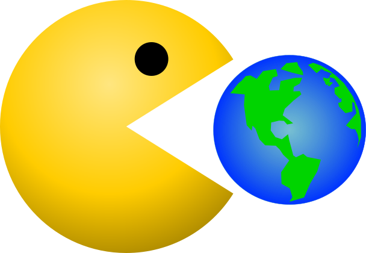
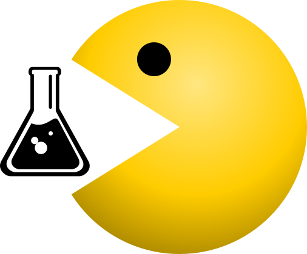
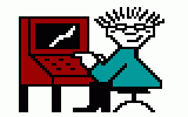
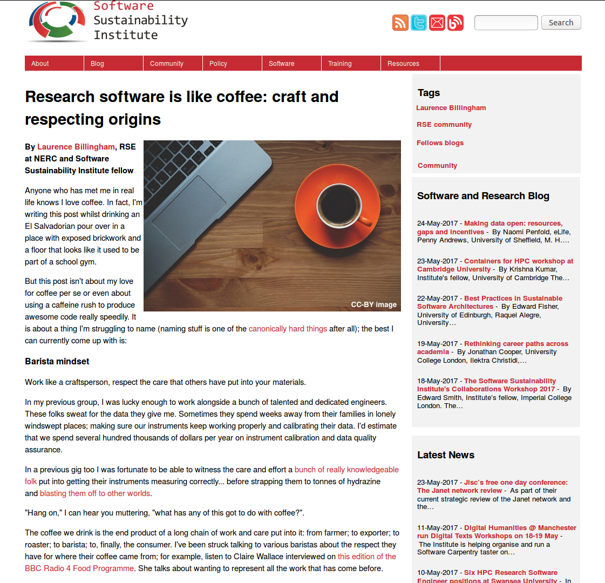

# Research Software Engineers

## The people behind research software 

Stephan Druskat  
Dept. of German Studies and Linguistics  
Humboldt-Universität zu Berlin  
OpenTechSummit, 25 May 2017, Potsdam, Germany

Note:
Okay, notes work!

## Sleepy kitty sez:  

## English ▶

## German ▼

## Software in der Wissenschaft

&#160;&#160;&#160;&#160;

Forschungssoftware:  
erstellen, verarbeiten, analysieren, darstellen von Forschungsdaten  
▶ Begleitung des gesamten Forschungsprozesses
<!-- .element class="fragment" -->

▶ Softwareentwicklung, -pflege: zentrale Rolle in der Forschung?
<!-- .element class="fragment" -->

Note:
Jeder weiß: Software is eating the world. **CLICK** 

Das bedeutet natürlich auch, dass **Software die Wissenschaft frisst.**  
Wahr spätestens seit dem **Aufkommen der digitalen Geisteswissenschaften**: Software **spielt eine zentrale Rolle in der Forschung** in quasi **allen wissenschaftlichen Disziplinen.**  
Frage: **Was ist Forschungssoftware?**  **CLICK**

Antwort: Software, die **Forschungsdaten bearbeitet**, z.B.  

- **erstellt** (Sensordaten ausliest, Digitalisate erstellt, Korpora extrahiert, etc.)
- **verarbeitet** (ändert, anreichert, umwandelt)
- **analysiert** (qualitativ, quantitativ, durchsucht)
- **visualisiert** (in Grafiken, Graphen, Diagrammen, etc.)
 
Forschungssoftware **begleitet den gesamten Forschungsprozess.**  **CLICK**

D.h.: **Entwicklung und Pflege von Forschungssoftware** eine **zentrale Rolle im Forschungsprozess** spielt, bzw. spielen sollte.

## Software in der Wissenschaft

▶ Software ist kein Forschungsergebnis!?  
▶ Forschungsergebnisse ohne Software (oft) nicht möglich!  
*▶ Forschung selbst ohne Software (oft) nicht möglich!*  
<!-- .element class="fragment" -->
*▶ Software kann ein Forschungsergebnis sein?!*  
<!-- .element class="fragment" -->

Note:
Frage: **Ist das so?**  
Antwort: **Nein!** Forschungssoftware durch die Wissenschaft **stiefkindlich** behandelt.  
**Wie äußert sich das?**
 
- Nur selten (außer Informatik) **als Forschungsergebnis anerkannt** und als solches behandelt    
- Einleuchtend, dass **Forschungsdaten** (insbesondere vorverarbeitete) ein Forschungsergebnis sind.  
- Das wird **seit längerem honoriert durch intensive Beschäftigung** mit den *Voraussetzungen*, *Erstellung*, *Aufbewahrung*, *Zugänglichmachung* und *Zitation*
- **Für Software gilt das noch nicht!**
- Hängt auch damit zusammen, dass Forschungssoftware **uneinheitliche Objekte beschreibt**, z.B. **kleine Skripte** und **große Infrastrukturen**
 
ABER: ohne Forschungssoftware können z.B. **Forschungsdaten (oft) nicht erstellt bzw. verarbeitet werden** **CLICK** 

Man **braucht also Software um  Forschung möglich zu machen!**    
Klar, dass das **keine leichte Aufgabe** ist. **CLICK**  

ABER: Bei der Entwicklung von Forschungssoftware muss man sich **intensiv mit dem Forschungsgegenstand und seinen Daten** auseinandersetzen.  
Das ist **Teil der Forschung!**  
Daher **sollte klar sein**, dass die **dadurch entstandene Software auch ein vollwertiges Forschungsergebnis** sein muss.

## Software in der Wissenschaft

### Nachholbedarf!

- Verfügbarkeit / Nutzbarkeit von Forschungssoftware
- Mehrfach- / Parallelentwicklung
- Fehlende Qualitätsstandards
- Fehlende Reproduzierbarkeit
- Lizenzen? Intellectual Property?

Note:
Schön, das festgestellt zu haben!  
Aber es gibt noch **Nachholbedarf**, zum Beispiel ist Forschungssoftware teilweise   
 
- **eingeschränkt nutzbar und verfügbar**
- **Mehrfach- und Parallelentwicklung**
- **Fehlende Qualitätsstandards für Entwicklung und Begutachtung**  
- **Fehlende Reproduzierbarkeit**, z.B. von Simulationsergebnissen
- **Lizenzen** und **geistiges Eigentum** oft **unklar**

## Software in der Wissenschaft

**Software ≠ Forschungsergebnis ▶ Keine Anreize für Softwareentwicklung in der Wissenschaft**

- Keine wissenschaftliche Anerkennung
- Keine Form für Softwareentwickler in der Wissenschaft
- Keine Reputation
- Kompetenzen weder verlangt noch gefördert

Note:
**Das Problem ist:** Wenn also Forschungssoftware **kein vollwertiges Forschungsergebnis** ist, dann heißt das:  
Es gibt **keine Anreize, Software in der Wissenschaft zu entwickeln** um die genannten Probleme zu lösen  
Konkret:
 
- **Anerkennung** von Softwareentwicklung als **wissenschaftliche Leistung fehlt**
- Kein **definierter Platz** für Softwareentwickler in der Wissenschaft: keine passenden Stellenbeschreibungen, Jobtitel, Vergütungskategorien, etc.
- **Leistungen im Bereich Software nicht verankert im wiss. Reputationssystem** (Zitate, Bewertungsmaße, etc.)
- **Kompetenzen** im Software Engineering werden **weder verlangt noch gefördert**  

Das Ergebnis davon ist: **CLICK**

## Software in der Wissenschaft

Immerhin: ein (informeller) Jobtitel!

## Research Software Engineer (RSE)

Note:
Immerhin, **eine Lösung gibt es**: einen informellen Jobtitel: Research Software Engineer!  
Frage: Was ist ein RSE?

## Research Software Engineers?

Bekannte Merkmale:

- angestellt, um Software für die Forschung entwickeln;
- verbringen wesentliche mehr Arbeitszeit mit Softwareentwicklung als mit anderer Forschung;
- sitzen auf PostDoc-Stellen, obwohl sie Software entwickeln;
- kümmern sich "um den Computerkram der Forschungsgruppe";
- sind keine Ko-Autoren bei Veröffentlichungen die auf ihrer Software beruhen;
- haben keine Maße für das Vorantreiben ihrer Karriere;

Note:
Forschungssoftware wird **von Personen in den unterschiedlichsten Rollen entwickelt**  
Alle lassen sich **unter RSE zusammenfassen**  
Man erkennt RSEs zum Beispiel **an folgenden Merkmalen**
 
- angestellt, um Software für die Forschung zu entwickeln;
- verbringen **wesentliche Teile ihrer Arbeitszeit** damit Software zu entwickeln statt mit anderen Forschungstätigkeiten;
- **sitzen auf PostDoc-Stellen**, obwohl sie vornehmlich Forschungssoftware entwickeln;
- werden vorgestellt als **die, die "sich um den Computerkram der Forschungsgruppe kümmern"**
- **tauchen nicht als Ko-Autoren von Veröffentlichungen auf**, obwohl sie eine **wichtige Rolle in der Entwicklung der Forschungssoftware** gespielt haben, mit der die Veröffentlichung entstanden ist;
- haben **keine Hilfsmaße zum Vorantreiben** der wissenschaftlichen **Karriere** (Veröffentlichungen), obwohl sie **wichtige Beiträge zur Forschung** gelesitet haben, nur eben **durch Software**

## Research Software Engineers!

Note:
Man sollte verstehen: RSE ist vor allem eine **Rolle** und eine **Menge von Fähigkeiten**, die durch **tiefgreifende Einsicht in die Forschung** erweitert werden
 
Man kann auch sagen: **RSEs sind Menschen, die in der Forschung arbeiten, sich um Forschungssoftware kümmern und denen Software am Herzen liegt.** 

Auf der *Website des Software Sustainability Intitute* gibt es einen Blogpost von **Laurence Billingham**:
**Vergleich von RSEs mit Baristas**, weil wir mit *Respekt für die Rohstoffe* (Forschungsdaten) diese *handwerklich mit hochwertigen Werkzeugen* weiterverarbeiten.    
Man könnte auch sagen: **RSEs sind Kleinbauern**  (oder Großbauern), die **Rohstoffe umsichtig herstellen**.    
Oder: **Betriebe, die hochwertige Weiterverarbeitungsanlagen** bauen.    
Oder: eine Art **Familienbetrieb, der die optimale Espressomaschine** herstellt

## RSE-Initiativen

### UKRSE Association (2013)

### de-RSE (2016)

(16. September 2016: github.com/DE-RSE/www commit 4871e6740a678ddd9ba51db5e67cd6ea235cb9b2)

Note:
**Ein bißchen was Geschichtliches zum Begriff noch**  
Der Begriff des Research Software Engineers wurde in Großbritannien geprägt, wo sich im März 2012 am Queen's College Oxford erstmals eine Gruppe traf, um sich mit der Frage zu beschäftigen, warum es in der Wissenschaft keine Karrierepfade für Softwareentwickler gibt.  
Dies mündete schließlich im Beitrag "The Research Software Engineer" für die Konferenz "Digital Research", die im September 2012 ebenfalls in Oxford stattfand.  
Eine Folge davon war ein Workshop zum Thema ein Jahr später, ebenfalls in Oxford, und die anschließende Gründung der UKRSE Association, die Veranstalter der schließlich 2016 stattfindenden allerersten RSE-Konferenz in Manchester war.
 
Weil es **für Deutschland dieselben Herausforderungen gibt** liegt es nahe, hier **eine ähnliche Struktur aufzubauen**  
Genau das ist passiert: de-RSE ist sozusagen eine **Zweigstelle der UKRSE Association** 
-- **Stephan Janosch** (Max-Planck-Institut für Molekulare Zellbiologie und Genetik, Dresden)
-- **Martin Hammitzsch** hier aus Potsdam vom GFZ
-- **Frank Löffler** (Louisiana State University)

## de-RSE - Mitmachen!

- Interessenvertretung aller RSEs in Deutschland
- Herausforderungen aus regionaler Perspektive angehen
- Ein Forum bieten
- Alle RSEs sind willkommen!
	- Diskutieren
	- Lösungen entwickeln
	- Sich austauschen

Note:
Am Anfang: **GitHub-Page und Mailingliste**    
Inzwischen: **aktiver Slack-Channel**, Mailingliste **über 70 Mitglieder**, **Blog** auf der Website, **Meetup** bei Non-Textual Information in Hannover  
Nächste Schritte: Gründung **gemeinnütziger Verein** (z.B. um eine Konferenz organisieren zu können)
 
** Alle sollen mitmachen!**
 
- de-RSE als **Interessenvertretung aller RSEs** in Deutschland
- Herausforderungen **aus regionaler Perspektive** angehen  
- Alle sind willkommen! **Diskutieren**, **Lösungen entwickeln**, austauschen mit anderen Menschen, die **in der Forschung arbeiten, sich um Forschungssoftware kümmern und denen Software am Herzen liegt.**

## Danke!

### [de-rse.org](http://de-rse.org) (+ [Blog](http://www.de-rse.org/de/blog.html))

### [liste@de-RSE.org](mailto:liste@de-RSE.org)

### [de-rse.slack.com](https://de-rse.slack.com)

stephan.druskat@hu-berlin.de  
[@sdruskat](https://twitter.com/stdruskat)  
[Onlineversion](http://sdruskat.github.io/de-rse-ots-2017/)

- http://de-rse.org
- http://rse.ac.uk
- https://www.software.ac.uk/blog/2016-11-17-not-so-brief-history-research-software-engineers
- http://digital-research-2012.oerc.ox.ac.uk/papers/the-research-software-engineer
- https://www.software.ac.uk/blog/2017-04-27-barista-mindset-how-treat-coding-craft
- "Nerd": Wikipedia user MGA73bot2 (CC-BY-SA-3.0)
- "Angry face": Wikipedia user Itsmefor3 (CC-BY-SA-4.0)
- "Better software better research": Software Sustainability Institute (CC-BY-NC-2.5)
- Blog Screenshot: Software Sustainability Institute (CC-BY-NC-2.5)
- Andere: CC0-1.0 

## Software in science

&#160;&#160;&#160;&#160;

Resesarch software:  
Creation, processing, analysis, visualisation of research data  
▶ Along for the whole ride
<!-- .element class="fragment" -->

▶ Software development/maintenance: central role in research?
<!-- .element class="fragment" -->

Note:
Everybody knows that software is eating the world.  
This means, of course, that software is eating science, too. **CLICK**

True: at least since the **advent of the Digital Humanities**, software has played a central role in pretty much every scientific discipline.  
But **what is scientific software**, or research software?  **CLICK**

It is software that handles research data.  
This can mean that it

- creates research data (such as reading sensor data, digitizing texts, extracting corpora, etc.)
- processes research data (that is, changes it, enriches it, transforms it)
- analyses research data (be it qualitatively, quantitatively, or via search)
- visualizes research data (in graphics, graphs, diagrams, etc.)

As you can see, software is there for the whole research process.  **CLICK**

This also means that the development and maintenance of research software plays a central role in the research process.  
Or at least it should.

## Software in science

▶ Software is not a research result!?  
▶ Research results (often) impossible without software!  
*▶ Research itself (often) impossible without software!*  
<!-- .element class="fragment" -->
*▶ Software can be a research result?!*  
<!-- .element class="fragment" -->

Note:
Because up to now, **research software** has unfortunately been **treated a bit like Cinderella**, with science being the evil step mother.  
How is that?

For one part, software **is hardly ever recognized as a primary research outcome**, at least outside of computer science.  
People have recognized for a while now that **research data**, especially preprocessed research data, are in fact a research outcome.   
This not only makes sense, there has also been a relatively intensive discussion about the premises, elicitation and generation, storage and availability, and reference of research data for quite some time.  
The same cannot be said for software. Yet.  
This is also due to the fact that the term "research software" is used to describe a **wide variety of objects.**  
Research software can be anything from small scripts that have been created on the fly to solve a specific problem, or make an arduous task that much easier, to large software infrastructures with a large user base and millions of lines of code.  

The point that everyone seemed to have missed, though, is that **without software, other research outcomes (such as research data for example) can often not be created or processed** in the first place.  **CLICK**

In order **to enable research, therefore, software must be created**.  
The problem, and I think everybody here will know that, is that making software is not a trivial task.  **CLICK**

Now, add the fact that research per definition includes the scrutinous inspection of a research object and its data.  
Then, it **should become sufficiently clear that the product of this whole process**, namely the software product, **must be regarded a regular research outcome.**  

## Software in science

### A long way to go!

- Availability / usability of research software
- Multiplicate / parallel developments
- Lack of quality standards
- Lack of reproducibility
- Licenses? Intellectual property?

Note:
**Despite this noble claim, we still have a long way to go.**  
Here is an **incomplete list of why**:

- Limited availability and usability of research software
- Multiple and parallel implementation of solutions for the same problem
- A lack of quality standards for the development and review of research software
- A lack of reproducibility, for example of simulation results
- Unclear policies regarding publication, for example in terms of licenses and intellectual property

## Software in science

**Software ≠ Research result ▶ No incentives for software development in science**

- No academic recognition
- No defined place for software developers in science
- No reputation
- Competences neither sought nor promoted

Note:
Now, the disregard of software as a first class citizen of research results leads directly to another set of issues:  
There are simply no incentives for the creation of software in science, for example to solve the above-mentioned issues.  
More precisely:

- A lack of recognition for software development as a scientific achievement in general
- There is no dedicated space for software developers in the academic system, i.e., no suitable job descriptions, no suitable job titles, no column in the wage table, etc.
- Achievement in research software development is not linked to the academic reputation system, for example through citations, impact metrics, etc.
- Skills in software development are usually neither asked for nor promoted

## Software in science

At least: an (informal) job title!

## Research Software Engineer (RSE)

Note:
This all **sounds very bleak**, doesn't it!
Well, at least there is **a silver lining with regard to one of these issues**, namely an informal job title: Research Software Engineer!

## Research Software Engineers?

Potential properties:

- Employed to develop software for research;
- spends more time developing software than with other research;
- employed as PostDoc despite mostly developing software;
- "does computers for the research group";
- not a co-author on publications powered by software contributed to significantly;
- no metrics to progress academic career.

Note:
But **what is a Research Software Engineer**?  
Research software is being developed and maintained by people in very different roles, with different approaches and with varying intensity.  
However, there is no reason why all of these people cannot be called Research Software Engineers (RSEs).  
RSEs can be distinguished, for example, by one or more of the following properties:  

- They are employed to develop software for research;
- they spend considerably more time developing software than with other research endeavours;
- they are employed as a postdoctoral researcher although the mainly develop software;
- they are introduced as the person who "does computers" in the research group;
- they are sometimes not named as co-authors on research papers despite having contributed significantly to a software that has been used to create them;
- they lack the metrics to progress their academic career, such as papers and conference talks, although they have contributed significantly to research through software;

## Research Software Engineers!

Note:
The variety of these examples shows that **RSE is not a formalised title**, but rather a set of skills, refined by an intimate understanding of research objects and processes. 

RSEs are, in short, **people who work in science and care about software.**  

Laurence Billingham has likened us to baristas, who respectfully process raw materials (research data) with high quality products.  
We could also be described as farmers carefully producing the raw materials; or as companies building high-end processing plants with engineer-grade precision; or as workshops crafting the optimal espresso machine.  

## RSE initiatives

### UKRSE Association (2013)

### de-RSE (2016)

(16 Sep 2016: github.com/DE-RSE/www commit 4871e6740a678ddd9ba51db5e67cd6ea235cb9b2)

Note:
A bit of history:  
The term "Research Software Engineer" has been created in the UK, or more precisely at Queen's College, Oxford, where in March 2012 a group of people met to discuss the question why there were no career paths for software developers in science.  
This lead to a paper titled "The Research Software Engineer" submitted to the "Digital Research" conference in Oxford in September 2012.  
This in turn triggered a dedicated workshop in Oxford a year later and the birth of the UKRSE Association, which organized the first ever RSE conference in Manchester in 2016.

But because the above-mentioned challenges not only apply in the UK, but in global science in general, it has been an obvious next step to build a simliar infrastructure elsewhere, for example in Germany.  
Incubated at the RSE conference in Manchester, three of its participants -- Stephan Janosch (Max-Planck-Institut für Molekulare Zellbiologie und Genetik, Dresden), Martin Hammitzsch (Deutsches GeoForschungsZentrum, Potsdam), and Frank Löffler (Louisiana State University) -- kickstarted de-RSE, the German chapter of the UKRSE Association.

## de-RSE - Join us!

- Represents the interests of all RSEs in Germany
- Tackles challenges from a regional perspective
- Provides a forum
- All RSEs welcome to
	- discuss
	- develop solutions
	- exchange with others

Note:
In the beginning, de-RSE was simply a GitHub page and a mailing list.  
By now, there is also an active Slack channel, the mailing list has grown to over 70 subscribers, the website has a blog, and there has been a first personal meetup at the "Non-Textual Information" conference in Hannover in May 2017.  
As a next step, we plan to found our own non-profit association (gemeinnütziger Verein), which will make it easier, for example, to organize the first ever German language RSE conference.  

de-RSE represents the interests of all Research Software Engineers in Germany.  
We want to tackle the present challenges from a specific regional perspective, for which we welcome all of you RSEs who are interested in contributing to the discussion, want to develop solutions, and use de-RSE as a forum for an exchange with people like yourself, who work in science and care for software.  

## Thanks!

### [de-rse.org](http://de-rse.org) (+ [Blog](http://www.de-rse.org/de/blog.html))

### [liste@de-RSE.org](mailto:liste@de-RSE.org)

### [de-rse.slack.com](https://de-rse.slack.com)

stephan.druskat@hu-berlin.de  
[@sdruskat](https://twitter.com/stdruskat)  
[Online version](http://sdruskat.github.io/de-rse-ots-2017/)

- http://de-rse.org
- http://rse.ac.uk
- https://www.software.ac.uk/blog/2016-11-17-not-so-brief-history-research-software-engineers
- http://digital-research-2012.oerc.ox.ac.uk/papers/the-research-software-engineer
- https://www.software.ac.uk/blog/2017-04-27-barista-mindset-how-treat-coding-craft
- "Nerd": Wikipedia user MGA73bot2 (CC-BY-SA-3.0)
- "Angry face": Wikipedia user Itsmefor3 (CC-BY-SA-4.0)
- "Better software better research": Software Sustainability Institute (CC-BY-NC-2.5)
- Blog Screenshot: Software Sustainability Institute (CC-BY-NC-2.5)
- Others: CC0-1.0 
